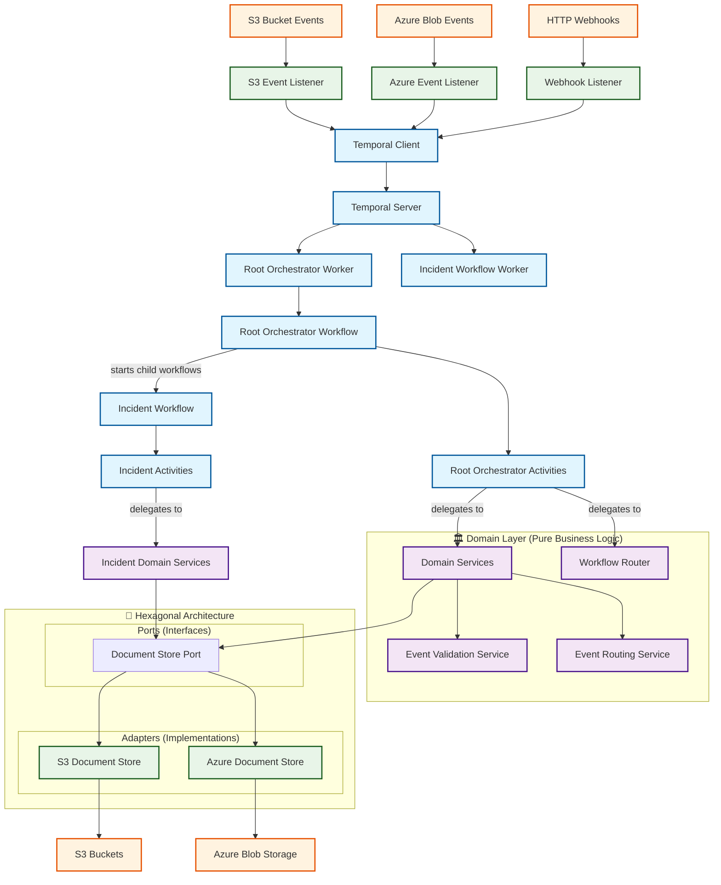

# Temporal Workflow Module Structure

This project organizes each workflow module with the following files:

1. **`__init__.py`**
   - Marks the directory as a Python package.
   - Optionally, can be used to expose or import key symbols for easier imports elsewhere.
   - Usually contains little or no logic.

2. **`activities.py`**
   - Defines the activity functions for the workflow.
   - Each function is decorated (e.g., with `@activity.defn`) so it can be registered and run by the Temporal worker.
   - Activities are thin adapters that handle Temporal concerns (serialization, logging, error handling) and delegate business logic to domain services.

3. **`workflows.py`**
   - Defines the workflow class and its logic.
   - The class is decorated (e.g., with `@workflow.defn`) so Temporal can discover and execute it.
   - The workflow orchestrates the order and conditions for calling activities, handling signals, and managing state.

4. **`run_worker.py`**
   - The entrypoint script for running a Temporal worker process.
   - Connects to the Temporal server, registers the workflow(s) and activity(ies), and starts the worker loop.
   - This is the file you run (or set as the Docker entrypoint) to start processing workflow and activity tasks for this module.

## Additional Architecture Components

This project also includes:

5. **`src/domain/`**
   - Contains pure business logic services with no framework dependencies.
   - Domain services handle validation, routing, data transformation, and business rules.
   - Easy to test without Temporal infrastructure.

6. **`src/ports/` and `src/adapters/`**
   - Implements hexagonal architecture pattern.
   - Ports define interfaces for external systems (e.g., document storage).
   - Adapters provide concrete implementations (e.g., S3, Azure Blob).

7. **`src/listeners/`**
   - External event listeners that trigger workflows.
   - Handle events from S3, Azure Service Bus, HTTP webhooks, etc.
   - Convert external events into workflow executions.

**Summary:**
This structure follows clean architecture principles with:
- **Clear separation** between Temporal infrastructure and business logic
- **Domain services** for testable, framework-independent business logic  
- **Activity adapters** for Temporal concerns (serialization, logging, errors)
- **Hexagonal architecture** for external system integration
- Easy to add, test, and maintain workflows and activities

## System Architecture Diagram

